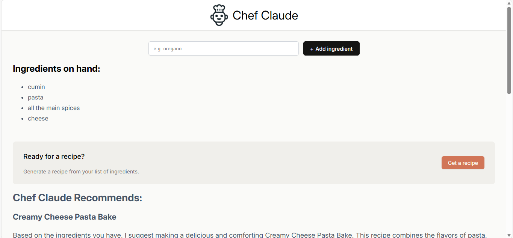

# Chef Claude 🍳🤖

Chef Claude is an AI-powered recipe generator that generates recipes based on user-provided ingredients.  
Built using **React + Vite** and powered by a **Hugging Face language model**.

---

## 🚀 Features
- Generate recipes from a list of ingredients
- AI-powered responses using Hugging Face
- Clean and responsive UI
- Component-based React architecture

---

## 🛠 Tech Stack
- React
- Vite
- JavaScript (ES6+)
- Hugging Face Inference API
- CSS

---

## 📸 Screenshots


---

## ⚙️ Setup & Installation
```bash
git clone https://github.com/Prasuk-2003/chef-claude.git
cd chef-claude
npm install
npm run dev
```

---

## 🔐 Environment Variables
Create a .env file using .env.example and add your Hugging Face access token.

---

## 🌐 Live Demo
👉 [https://chef-claude.vercel.app](https://chef-claude-beta-five.vercel.app/)

---

## 📚 What I Learned
- How to structure a React app using reusable components
- Managing API keys securely with environment variables
- Integrating AI models into frontend applications
- Handling async API calls and conditional rendering
